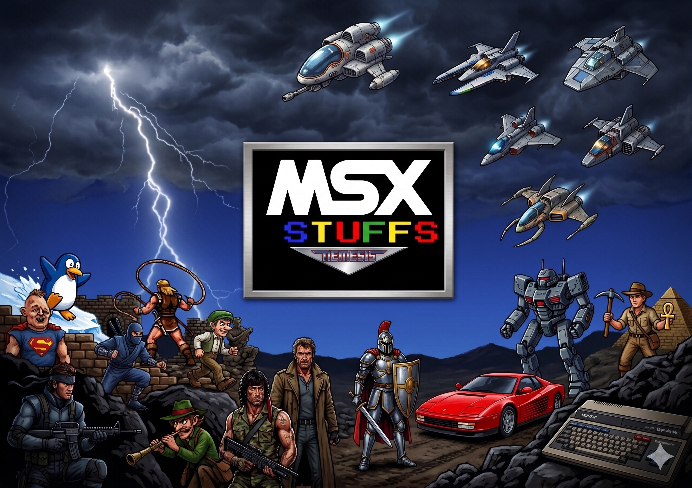
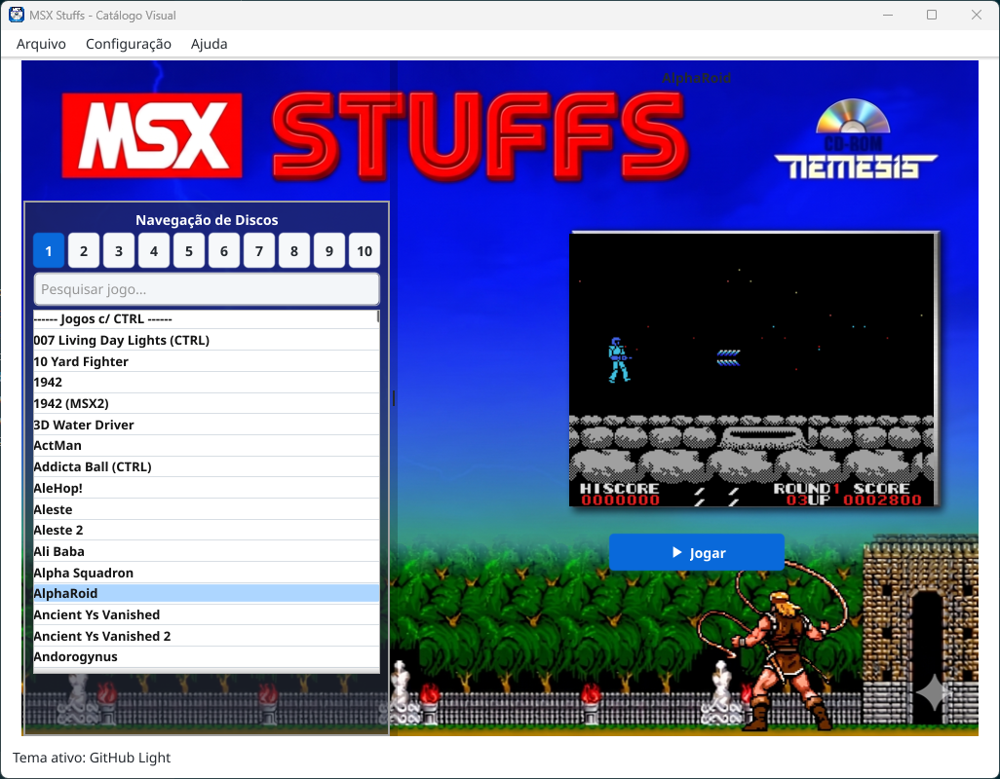

# MSX Stuffs - Catálogo Visual Moderno

Este projeto é uma modernização do clássico pacote **MSX Stuffs**, lançado originalmente pela **Nemesis Software** (Nemesis Informática) por volta dos anos 2000. 

## História e Contexto

O pacote original do **MSX Stuffs** consistia em uma série de **10 CDs** repleta de jogos e programas de MSX. O diferencial era um navegador visual bastante agradável para a época, desenvolvido originalmente em **Visual Basic 3.0**, que rodava nativamente apenas em sistemas **Windows 95/98**. 

Esse navegador permitia ao usuário visualizar a tela (screenshot) de cada jogo conforme navegava pela lista de nomes. Além disso, cada arquivo tinha uma linha de comando específica configurada para o emulador correspondente da época.

## O Projeto de Modernização

Este repositório traz a nostálgica experiência do MSX Stuffs original para sistemas modernos, com diversas inovações:
- **Interface Gráfica Completa**: Painel lateral com seletor segmentado para navegação rápida entre volumes (1 a 10) e caixa de pesquisa textual reativa (filtra por descrição ou nome do arquivo de jogo).
- **Detalhamento Visual e Screenshots**: Carregamento dinâmico de screenshots de jogos (em formato BMP/PNG) baseados na raiz do arquivo, com imagem de fallback caso a screenshot não exista.
- **Configurações Individuais de Emulação**: Botão "Reconfigurar" por jogo para definir o emulador favorito (openMSX, fMSX, blueMSX ou ruMSX), máquina do openMSX, extensões e opções livres, permitindo um alto grau de personalização de compatibilidade.
- **Banco de Dados SQLite**: Banco SQLite embarcado que organiza todos os mais de 3.000 títulos e configurações globais e específicas de forma ágil.
- **Suporte Multilíngue (i18n)**: Localização nativa para 5 idiomas (Inglês, Português, Italiano, Espanhol e Holandês).
- **Histórico e Logs de Execução**: Monitoramento em tempo real do status do sistema e da saída padrão/erro dos emuladores em uma janela de logs acessível na própria interface.
- **Inicialização Fluida**: Tela de splash animada com fade-out na inicialização do aplicativo.

### Créditos e Licenciamento
Gostaríamos de dar todo o crédito histórico à **Nemesis Informática** pela idealização original e seleção primorosa de jogos da série MSX Stuffs. 

> [!NOTE]
> Tentamos entrar em contato com duas pessoas ligadas à antiga Nemesis Informática para obter autorização prévia, porém não obtivemos resposta. Este projeto é de caráter puramente preservativo e de homenagem. Caso qualquer ex-membro ou detentor de direitos sinta-se incomodado com a disponibilização deste material, basta entrar em contato que removeremos o projeto sem qualquer hesitação ou problema.

---

## Tecnologias Utilizadas

A modernização deste projeto foi desenvolvida utilizando a seguinte pilha de ferramentas e tecnologias:

*   **Go** (Golang) + **Fyne v2** para construção de lógica robusta e interface gráfica nativa e portátil.
*   **SQLite** + Driver Pure Go (`modernc.org/sqlite`) permitindo persistência de dados local sem exigir o CGO habilitado para o banco de dados.
*   **Cobra CLI** para estruturação e expansão futura de comandos e flags de terminal.
*   **Antigravity** (Assistente de pair programming).
*   **Helix** (Editor de texto).
*   **010 Editor** (Editor hexadecimal para análise e engenharia reversa de arquivos originais).
*   **Gemini AI** (Modelo de inteligência artificial da Google para auxílio em design e codificação).
*   **Windows 11** & **PowerShell 7** para desenvolvimento, automação de build e execução de scripts.

---

